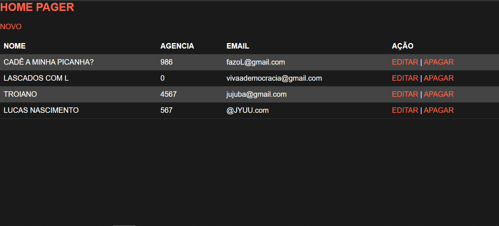
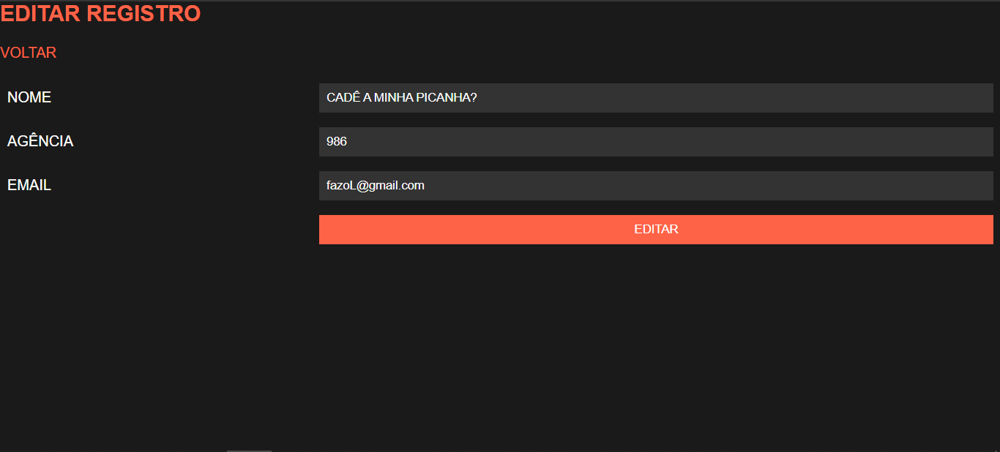
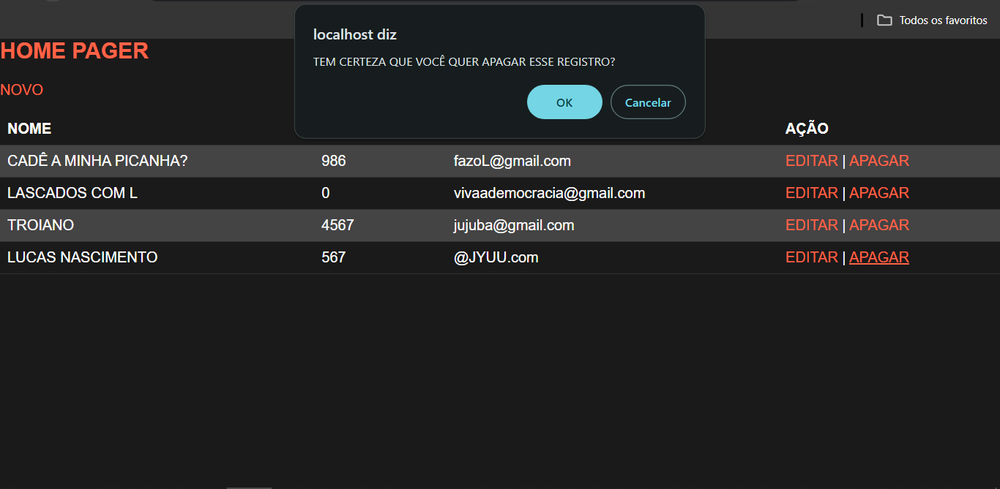
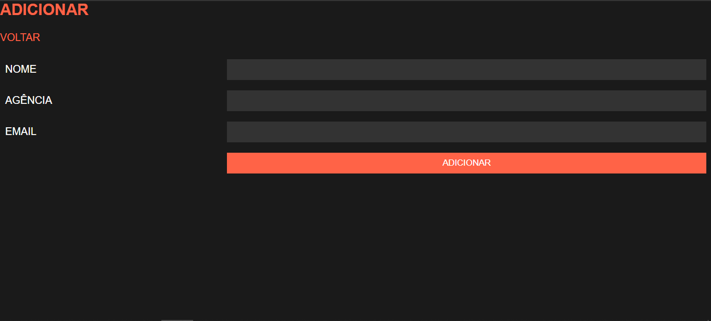
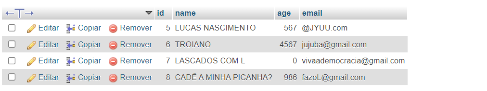

# CRUD COM PHP E MYSQL
👨‍🏫CRUD EM HTML, CSS, PHP E MYSQL.

 <br> 
 <br> 
 <br> 
 <br> 
 <br> 

## DESCRIÇÃO:
Este aplicativo implementa um sistema básico de gerenciamento de usuários com funcionalidades de criação, leitura, atualização e exclusão (CRUD). Aqui está uma descrição do que ele faz e exibe:

1. **Home Page:**
   - Exibe uma página inicial com o título "CRUD".
   - Apresenta um link "NOVO" que direciona para a página de adição de novos usuários.

2. **Lista de Usuários:**
   - Mostra uma tabela com os dados dos usuários registrados no sistema.
   - Os dados exibidos incluem o nome do usuário, idade, e-mail e ações disponíveis para cada usuário.
   - As ações disponíveis para cada usuário são "EDITAR" e "APAGAR".
   - O link de edição redireciona para a página de edição do usuário correspondente.
   - O link de exclusão solicita uma confirmação antes de excluir o usuário.

3. **Funcionalidades:**
   - **Adicionar Novo Usuário:** Permite adicionar um novo usuário ao sistema através do link "NOVO".
   - **Editar Usuário:** Permite editar as informações de um usuário existente clicando no link "EDITAR" ao lado do respectivo usuário na lista.
   - **Excluir Usuário:** Permite excluir um usuário existente clicando no link "APAGAR" ao lado do respectivo usuário na lista. Uma confirmação é solicitada antes da exclusão.

4. **Mensagens de Feedback:**
   - Fornece feedback ao usuário sobre as ações realizadas, como adição bem-sucedida de um novo usuário ou erros de validação ao adicionar um novo usuário.

## CRUD:
### C - Create (Criar):
* O link "NOVO" leva a uma página com um formulário para inserir novos usuários no banco de dados.

### R - Read (Ler):
* A conexão com o banco de dados é estabelecida usando a biblioteca `mysqli`.
* A query `"SELECT * FROM users ORDER BY id DESC"` recupera todos os usuários da tabela `users`, ordenando-os por ID decrescente (os mais recentes primeiro).
* O uso de um loop `while` percorre cada linha do resultado e exibe as informações (nome, agência, email) em uma tabela HTML.

### U - Update (Atualizar):
* O link "EDITAR" em cada linha da tabela direciona para uma página `edit.php` que permite modificar os dados do usuário correspondente.

### D - Delete (Deletar):
* O link "APAGAR" em cada linha da tabela, com confirmação do usuário, redireciona para a página `delete.php` que executa uma query para remover o usuário do banco de dados.

## COMO USAR?
### BAIXANDO O PROJETO:
* Clone o repositório para o seu sistema local:

```bash
git clone https://github.com/VILHALVA/CRUD-COM-PHP-E-MYSQL.git
```

* Navegue até o diretório do projeto.

```bash
cd CRUD-COM-PHP-E-MYSQL
```

* Descompacte o arquivo ZIP (se você baixou manualmente):

```bash
unzip CRUD-COM-PHP-E-MYSQL.zip
```

### EXECUTANDO O PROJETO:
1. **Configuração do Banco de Dados:**

   - Crie um banco de dados MySQL chamado `test`.
   - Execute o seguinte comando SQL para criar a tabela `users`:

   ```sql
   CREATE TABLE `users` (
   `id` int(11) NOT NULL auto_increment,
   `name` varchar(100) NOT NULL,
   `age` int(3) NOT NULL,
   `email` varchar(100) NOT NULL,
   PRIMARY KEY  (`id`)
   );
   ```

2. **Configuração do PHP:**

   - Abra o arquivo `index.php` e ajuste as configurações do banco de dados:

     ```php
     $servidor = "localhost";
     $username = "seu_usuario";
     $usersenha = "sua_senha";
     $database = "registro";
     ```

3. **Executando o Aplicativo:**

   - Coloque os arquivos em um servidor web compatível com PHP (por exemplo, XAMPP, WAMP, LAMP).
   - Acesse o formulário no navegador visitando `http://localhost/CODIGO/index.php`.

## NÃO SABE?
- Entendemos que para manipular arquivos em `HTML`, `CSS` e outras linguagens relacionadas, é necessário possuir conhecimento nessas áreas. Para auxiliar nesse aprendizado, oferecemos cursos gratuitos disponíveis:
* [CURSO DE HTML E CSS](https://github.com/VILHALVA/CURSO-DE-HTML-E-CSS)
* [CURSO DE PHP](https://github.com/VILHALVA/CURSO-DE-PHP)
* [CURSO DE MYSQL](https://github.com/VILHALVA/CURSO-DE-MYSQL)
* [CURSO DE MYSQL COM PHP](https://github.com/VILHALVA/CURSO-DE-MYSQL-COM-PHP)
* [CONFIRA MAIS CURSOS](https://github.com/VILHALVA?tab=repositories&q=+topic:CURSO)

## CREDITOS:
- [PROJETO CRIADO PELO "CHAPAGAIN"](https://github.com/chapagain/crud-php-simple)
- [PROJETO EDITADO PELO VILHALVA](https://github.com/VILHALVA)


